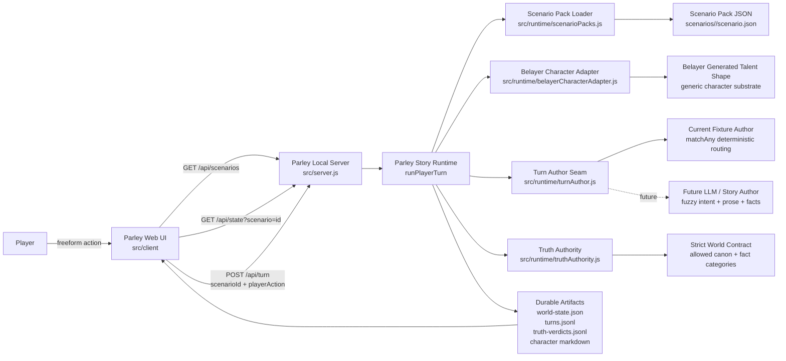
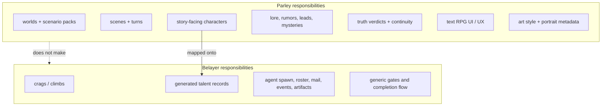
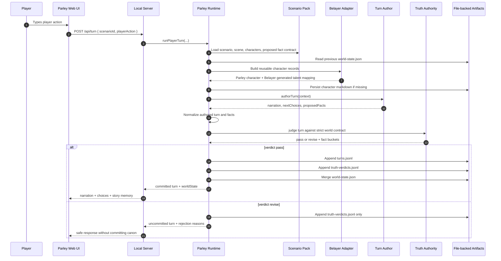
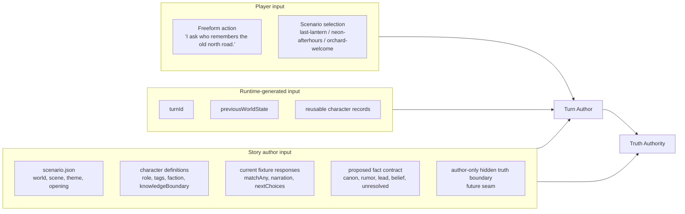
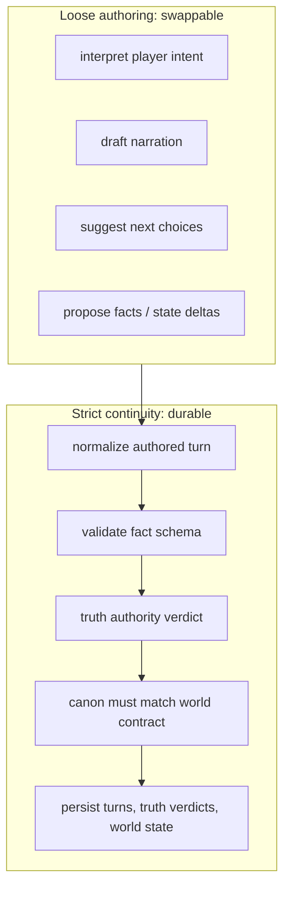
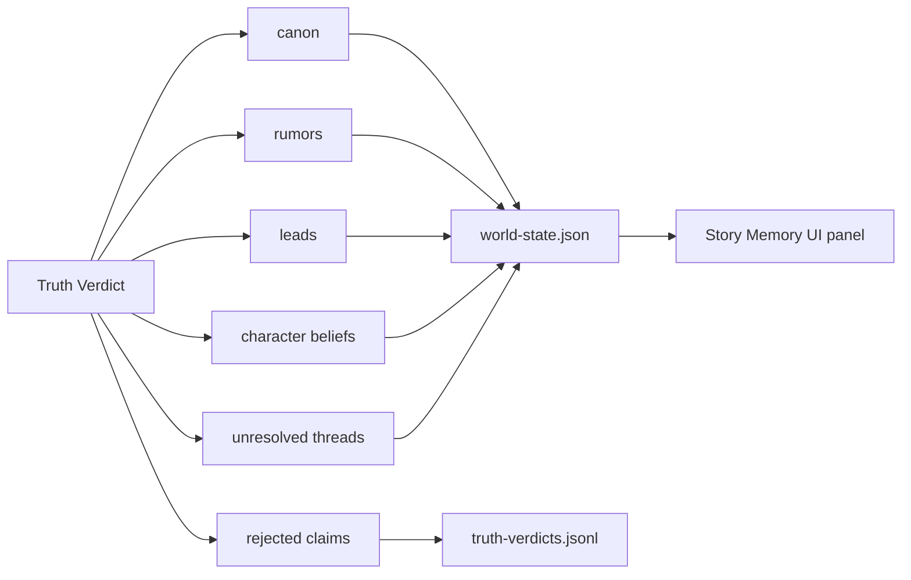
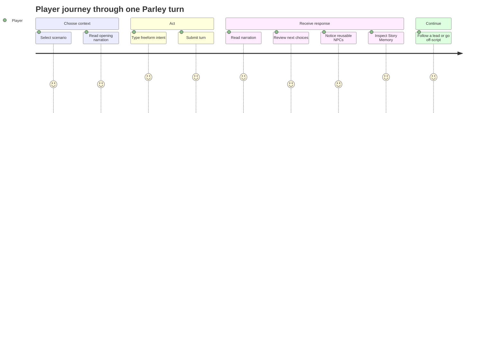

# Parley Framework Architecture

This document is a review map for what Parley is doing, how it uses Belayer, where player input enters the system, and where a story author or future LLM author contributes content.

## One-sentence model

Parley is a story runtime layered on Belayer: the player gives freeform intent, a turn author drafts narration and proposed state changes, a truth authority decides what becomes durable story memory, and Belayer provides the generic generated-talent substrate for reusable characters.

## Current proof slice

The current local slice proves:

- one browser UI can run multiple worlds/scenarios;
- player input flows through a single `runPlayerTurn` path;
- deterministic scenario packs are data fixtures, not custom frontend branches;
- every NPC is persisted as a reusable Parley character backed by a Belayer generated-talent record;
- story memory is structured into canon, rumors, leads, beliefs, and unresolved threads;
- loose authoring is separated from strict continuity/persistence.

## System map



## Boundary between Parley and Belayer

Belayer should stay generic. Parley should stay story-aware.



### Practical meaning

- Belayer sees reusable generic talent records.
- Parley decides that a talent is `Mara Underbough`, a tavernkeep with a knowledge boundary and future callback potential.
- Belayer should not learn concepts like canon, rumor, mystery, or hidden truth.
- Parley should not reimplement generic agent orchestration if Belayer already owns it.

## Turn lifecycle



## Inputs: player vs story author



### Player input

The player supplies intent, not canon. In the current app, this is the text input posted to `/api/turn` as `playerAction`.

Examples:

```text
I ask who remembers the old north road.
I ask Kestrel-9 where the missing maintenance order was routed.
I lie and say June already confessed.
```

### Story author input

The story author supplies the world contract and optional fixture beats. Today that lives in `scenarios/<scenario-id>/scenario.json`:

- world identity and tone;
- scene identity;
- opening narration;
- suggested player intents;
- reusable character definitions;
- deterministic response fixtures for the proof slice;
- proposed facts, scoped by response ID.

In the future, the deterministic response fixture section should shrink or disappear. The author should mostly define world contract, character boundaries, hidden truths, scenario constraints, and eval expectations. The LLM-style turn author should draft the moment-to-moment prose.

## The strict / loose split



### Loose side

The loose side is allowed to be creative. It can be deterministic today and LLM-authored later.

Current implementation:

- `createScenarioFixtureAuthor()` selects a deterministic response with `matchAny`.
- This exists to make demo packs runnable and repeatable.

Future implementation:

- classify player intent fuzzily;
- draft new narration;
- extract proposed facts from the draft;
- suggest next actions based on current world state;
- respect character knowledge boundaries and hidden truth boundaries.

### Strict side

The strict side is not allowed to be vibes.

Current implementation:

- `normalizeAuthoredTurn()` validates author output shape;
- `evidence_turn` is assigned by runtime, not trusted from the author;
- `judgeTurn()` rejects unsupported canon;
- accepted canon is materialized from the scenario contract, not author-supplied payload;
- `buildWorldState()` merges durable categories cumulatively.

This is the split that keeps Parley from becoming a prompt-template toy.

## Story memory and persistence



Persisted artifacts:

```text
worlds/<world-id>/
  characters/<character-id>.md
  state/
    world-state.json
    turns.jsonl
    truth-verdicts.jsonl
```

The UI should display Story Memory from cumulative `world-state.json`, not from the latest turn alone. That distinction matters because off-script turns must not erase earlier discoveries.

## Current implementation files

| Concern | File(s) | Notes |
| --- | --- | --- |
| Browser UI | `src/client/index.html`, `src/client/app.js`, `src/client/styles.css` | Local Twine-inspired prototype UI. |
| HTTP API | `src/server.js` | Serves static UI plus `/api/scenarios`, `/api/state`, `/api/turn`. |
| Runtime loop | `src/runtime/parleyRuntime.js` | Owns turn lifecycle, persistence, and strict/loose handoff. |
| Scenario packs | `src/runtime/scenarioPacks.js`, `scenarios/*/scenario.json` | Data-driven worlds and current fixture beats. |
| Turn author seam | `src/runtime/turnAuthor.js` | Current deterministic fixture author; future LLM author plugs in here. |
| Belayer mapping | `src/runtime/belayerCharacterAdapter.js` | Maps Parley character definitions to Belayer generated-talent shape. |
| Truth authority | `src/runtime/truthAuthority.js` | Mock continuity editor and strict canon gate. |
| Evidence docs | `docs/demo/2026-05-02-human-scenario-playtest.md` | Actual browser-level human playtest logs. |

## What a story author should edit

For the current proof slice, a story author edits scenario pack data:

```text
scenarios/<scenario-id>/scenario.json
```

They should define:

- world premise and tone;
- scene title and opening situation;
- recurring NPCs and knowledge boundaries;
- suggested initial player intents;
- hidden truths or boundaries, when supported;
- fact contract categories: canon, rumor, lead, belief, unresolved;
- optional deterministic fixture responses for demos/tests.

They should not edit:

- frontend branches per world;
- runtime code per scenario;
- Belayer internals for story-specific concepts;
- persisted state artifacts by hand except for debugging.

## What the player experiences



The player should feel like they are talking to a living story, but the system should be able to explain what changed in state after each turn.

## Near-term open architecture questions

1. **Story author format:** Should scenario packs stay raw JSON, or move to a friendlier authoring format with generated JSON artifacts?
2. **Canon promotion:** What is the explicit workflow for promoting newly discovered/emergent facts into the world contract?
3. **LLM author contract:** Should the future author return one structured object, or should prose drafting and fact extraction be separate calls?
4. **Truth authority strength:** Should the truth authority be a second model, deterministic schema validator, or hybrid reviewer?
5. **Belayer integration depth:** At what point do reusable characters become actual Belayer-managed agents instead of local generated-talent records?
6. **UI migration timing:** Keep vanilla UI until layout/jobs are proven; migrate only when the interaction model stabilizes.

## Review checklist

Use this doc to review whether the architecture has the right boundaries:

- [ ] Story concepts remain in Parley, not Belayer.
- [ ] Belayer remains a generic generated-talent/control-plane substrate.
- [ ] Player input is treated as intent, not truth.
- [ ] Story author input defines world contract and boundaries.
- [ ] Loose authoring can be swapped later without rewriting persistence/UI.
- [ ] Strict truth review gates durable canon.
- [ ] Story Memory is inspectable, cumulative, and not just prose.
- [ ] Demo fixtures do not become the long-term storytelling contract.
