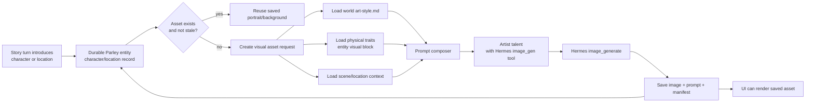
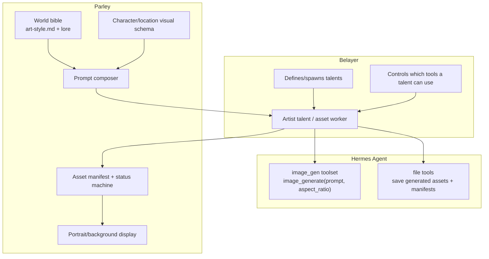
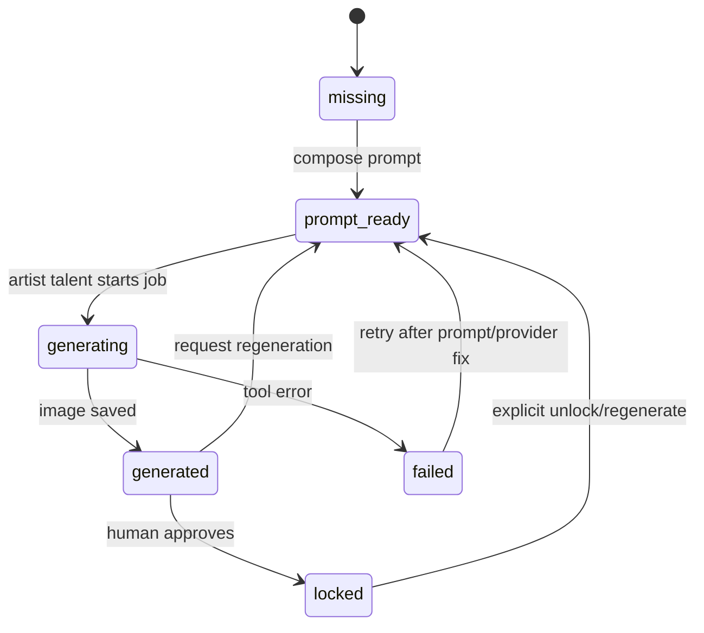
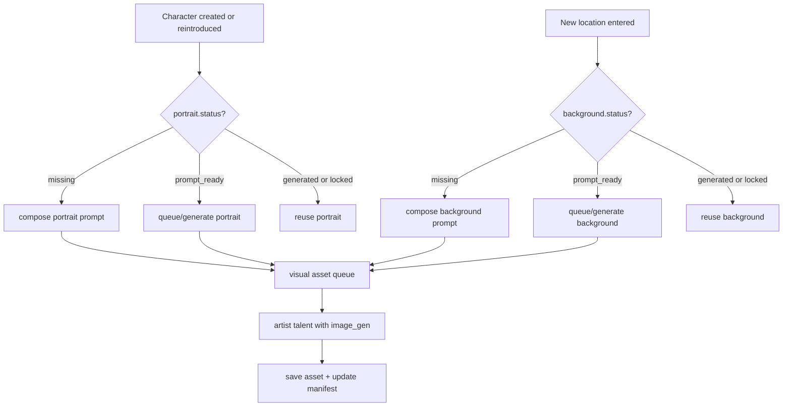

# Parley Visual Asset Pipeline Implementation Plan

> **For Hermes:** Use subagent-driven-development skill to implement this plan task-by-task.

**Goal:** Build Parley's visual asset pipeline as a core storytelling framework feature: world bibles define art direction, character/location creation produces reusable visual descriptions, artist talents compose prompts, Hermes image generation creates portraits/backgrounds, and generated assets are saved for reuse whenever characters or locations return.

**Architecture:** Treat image generation as an asynchronous asset-production step attached to durable story entities, not as a one-off demo button. Parley owns world/style/entity schemas, prompt composition, asset manifests, reuse/lock rules, and UI display. Belayer provides generic agent/talent orchestration and tool availability; Hermes provides the image generation tool behind an artist role.

**Tech Stack:** Current Parley Node runtime, file-backed world bible, Belayer generated talent records, Hermes `image_gen` toolset (`image_generate(prompt, aspect_ratio)`), local/static asset serving, markdown/json sidecars, browser UI.

---

## Current state

Parley already has a partial portrait seam:

- `docs/specs/parley-portrait-seam.md` defines `missing -> prompt_ready -> generated -> locked`.
- `docs/specs/parley-world-bible-shape.md` includes `art-style.md` and `assets/portraits/`.
- Scenario character definitions already carry `portrait.status`, `prompt_path`, and `asset_path`.
- `belayerCharacterAdapter.js` preserves portrait metadata into character records/markdown.
- UI does **not** display portraits yet.
- Background/location art is not modeled yet.
- Character records do not yet require rich physical descriptions/visual traits.

Hermes Agent already exposes an `image_gen` toolset. In our current environment this maps to the `image_generate` tool:

```ts
image_generate({
  prompt: string,
  aspect_ratio?: "landscape" | "square" | "portrait"
}) -> { image: string }
```

The actual backend is provider-configured/Nous-managed; Parley should not hardcode FAL/OpenAI/etc. Parley should call an abstract image tool from an artist role and persist the resulting asset path plus provenance.

## Design principle

Do not make "generate portrait" a demo-only UI button. It should be part of entity creation and reintroduction:

1. New character/location appears.
2. Runtime checks whether a reusable visual asset already exists.
3. If absent, Parley creates or schedules a visual asset request.
4. Artist talent composes a prompt from world style + entity visual facts + scene context.
5. Hermes image generation creates the asset.
6. Asset is saved into the world bible.
7. Entity record is updated to reference the asset.
8. Future appearances reuse the saved image unless explicitly regenerated.

## High-level flow



## Belayer / Hermes / Parley responsibilities



Parley should never depend on a specific image provider. It should depend on a capability: "given prompt + aspect ratio, return an image file/URL that can be persisted."

## World bible additions

Extend `worlds/<world-id>/art-style.md` from portrait-only guidance into a complete visual style contract.

```markdown
---
schema_version: parley-art-style/v1
world: last-lantern
default_seed_strategy: stable-per-entity
portrait:
  aspect_ratio: portrait
  framing: bust portrait, shoulders-up
background:
  aspect_ratio: landscape
  framing: visual novel background, clean composition for text overlay
  safe_overlay_zones:
    - bottom third
    - center lower third
---

## Style
Grounded fantasy. Painted with weight. Lantern-lit, rain-soft.

## Palette
Warm umber, rust, lamp-yellow, cold blue night through windows.

## Character Direction
Faces should feel lived-in and specific. Wardrobe communicates role, class, region, and work.

## Background Direction
Visual novel background, no characters in frame unless explicitly requested. Strong readable silhouettes, atmospheric depth, lower-third area with low visual noise for text input/output overlay.

## Negative
No glossy CG. No generic anime. No capes-and-armor heroics. No UI text baked into the image.
```

## Character visual schema

When Parley creates or updates a reusable character, it should create physical description fields, not just personality tags.

```yaml
visual:
  status: draft | locked
  age_range: "50s"
  build: "stout, broad-shouldered"
  face:
    - "round face with weathered smile lines"
    - "ash-grey hair pulled back"
  wardrobe:
    - "wool tunic"
    - "leather apron"
    - "copper key on a thong"
  signature_props:
    - "chipped blue bowl"
  palette_hints:
    - "warm browns"
    - "lamp-yellow highlights"
  negative:
    - "no armor"
    - "no modern zippers"
```

Rules:

- Visual facts must be stable enough to reuse.
- The story author or character-generation talent may draft them.
- The truth/continuity authority should gate durable visual changes the same way it gates canon.
- Locked visual blocks should not be rewritten casually; changing a recurring NPC's look is a continuity event.

## Location/background visual schema

Add first-class location records under `worlds/<world-id>/lore/locations/<id>.md`.

```yaml
---
schema_version: parley-location/v1
id: last-lantern-tavern
name: Last Lantern Tavern
visual:
  status: draft | locked
  environment_type: interior tavern
  time_of_day: rainy night
  composition: visual novel background, wide establishing shot
  landmarks:
    - "shuttered windows with cold blue rainlight"
    - "bar with blue chipped bowls"
    - "hearth glow on wet wool cloaks"
  safe_overlay_zones:
    - bottom third
  negative:
    - "no visible player character"
    - "no readable text/signage"
background:
  status: missing | prompt_ready | generated | locked
  prompt_path: worlds/last-lantern/assets/backgrounds/last-lantern-tavern.prompt.md
  asset_path: worlds/last-lantern/assets/backgrounds/last-lantern-tavern.png
---
```

Backgrounds should be prompted as **visual novel backgrounds**: wide, readable, atmospheric, designed to sit behind a text input/output overlay.

## Asset status machine

Use the same lifecycle for portraits and backgrounds:



Statuses:

| Status | Meaning |
| --- | --- |
| `missing` | Entity exists, no prompt or image. |
| `prompt_ready` | Prompt sidecar exists, image not generated yet. |
| `generating` | Artist worker has claimed the request. |
| `generated` | Image exists and may be regenerated. |
| `locked` | Human-approved; do not overwrite without explicit unlock. |
| `failed` | Generation failed; keep error/provenance for debugging. |

## Asset files

Extend world bible layout:

```text
worlds/<world-id>/
  art-style.md
  lore/
    locations/<location-id>.md
  characters/<character-id>.md
  assets/
    manifest.json
    portraits/
      <character-id>.prompt.md
      <character-id>.png
    backgrounds/
      <location-id>.prompt.md
      <location-id>.png
```

`assets/manifest.json` should be the machine-readable index:

```json
{
  "schema_version": "parley-asset-manifest/v1",
  "world": "last-lantern",
  "assets": [
    {
      "id": "portrait:mara-underbough",
      "kind": "portrait",
      "entity_type": "character",
      "entity_id": "mara-underbough",
      "status": "generated",
      "prompt_path": "worlds/last-lantern/assets/portraits/mara-underbough.prompt.md",
      "asset_path": "worlds/last-lantern/assets/portraits/mara-underbough.png",
      "prompt_hash": "sha256:...",
      "source_turn_id": "turn-0001",
      "provider": "hermes-image-gen",
      "generated_at": "2026-05-02T00:00:00Z"
    }
  ]
}
```

## Prompt sidecars

Prompts should be persisted before generation so they are reviewable and reproducible.

Portrait prompt sidecar:

```markdown
---
schema_version: parley-image-prompt/v1
kind: portrait
world: last-lantern
entity_id: mara-underbough
aspect_ratio: portrait
composer_version: 1
---

## Prompt
A bust portrait of Mara Underbough, a recurring tavernkeep...

## Style Source
worlds/last-lantern/art-style.md

## Entity Source
worlds/last-lantern/characters/mara-underbough.md

## Negative
No glossy CG. No armor. No modern zippers.
```

Background prompt sidecar:

```markdown
---
schema_version: parley-image-prompt/v1
kind: background
world: last-lantern
entity_id: last-lantern-tavern
aspect_ratio: landscape
composer_version: 1
---

## Prompt
Visual novel background of the Last Lantern Tavern interior on a rainy night...

## Overlay Requirements
Leave the lower third visually calm for text input/output overlay. No baked-in captions or UI.
```

## Tool contract for artist talents

Belayer can define available tools for each talent. Artist talents should get a narrow tool set:

```yaml
artist_talent:
  role: visual-asset-artist
  allowed_tools:
    - read_world_bible
    - read_entity_record
    - write_prompt_sidecar
    - image_generate
    - save_asset
    - update_asset_manifest
  forbidden:
    - edit_truth_state_directly
    - overwrite_locked_asset
    - read_hidden_truth_unless_explicitly_allowed
```

The Hermes image tool gives us:

```ts
image_generate(prompt, aspect_ratio)
```

But Parley should wrap it behind an internal adapter:

```ts
async function generateVisualAsset({ promptPath, aspectRatio, targetPath }) {
  const prompt = await readPrompt(promptPath);
  const image = await imageProvider.generate({ prompt, aspectRatio });
  await persistImage({ image, targetPath });
  return { assetPath: targetPath, provider: imageProvider.id };
}
```

This keeps the framework provider-agnostic and makes it testable with a fake provider.

## Runtime trigger points



Initial implementation can keep generation manual/CLI-triggered. The key is that the runtime creates durable asset requests whenever it creates durable entities.

## UI integration

Do this in layers:

1. **Placeholder cards first.** Show portrait/background status even before images exist.
2. **Static asset serving.** Let UI render saved assets from `/assets/...` or a safe API route.
3. **NPC portrait display.** NPC cards render portrait if `asset_path` exists; otherwise render themed initials/status placeholder.
4. **Location background display.** Story panel can use current scene background as a visual-novel backdrop behind the transcript/input overlay.
5. **Regeneration/admin controls later.** Not in player UI first; keep generation as author/tooling workflow.

Visual novel background constraints:

- landscape aspect ratio;
- no text baked into image;
- no important visual detail in lower third if text overlay sits there;
- use dim/blur/scrim overlay in CSS so text remains readable;
- keep background per location/scene stable unless explicitly regenerated.

## Implementation tasks

### Task 1: Define visual schema docs

**Objective:** Expand portrait-only docs into a generalized visual asset contract.

**Files:**

- Modify: `docs/specs/parley-portrait-seam.md`
- Modify: `docs/specs/parley-world-bible-shape.md`
- Create: `docs/specs/parley-visual-asset-pipeline.md` or promote this plan into that spec after review

**Steps:**

1. Add background asset lifecycle alongside portraits.
2. Define `visual` block requirements for characters and locations.
3. Define `assets/manifest.json` schema.
4. Define locked asset overwrite rules.
5. Add Mermaid lifecycle diagram.

**Verification:**

```bash
python3 - <<'PY'
from pathlib import Path
for p in ['docs/specs/parley-portrait-seam.md', 'docs/specs/parley-world-bible-shape.md']:
    s = Path(p).read_text()
    assert 'background' in s.lower()
    assert 'visual' in s.lower()
PY
```

### Task 2: Add art-style files to scenario worlds

**Objective:** Each current scenario has a world visual style contract.

**Files:**

- Create: `worlds/last-lantern/art-style.md`
- Create: `worlds/neon-afterhours/art-style.md`
- Create: `worlds/orchard-welcome/art-style.md`

**Steps:**

1. Write frontmatter with `parley-art-style/v1`.
2. Add portrait and background defaults.
3. Add world-specific palette, character direction, background direction, negatives.
4. Keep prompts professional and reusable, not tailored to one screenshot.

**Verification:**

```bash
for world in last-lantern neon-afterhours orchard-welcome; do
  test -f worlds/$world/art-style.md
  grep -q 'parley-art-style/v1' worlds/$world/art-style.md
  grep -qi 'Background Direction' worlds/$world/art-style.md
  grep -qi 'Negative' worlds/$world/art-style.md
done
```

### Task 3: Require visual traits on character records

**Objective:** Character creation produces physical descriptions/traits that artist talents can use.

**Files:**

- Modify: `scenarios/*/scenario.json`
- Modify: `src/runtime/belayerCharacterAdapter.js`
- Modify/Test: `test/parley-runtime.test.js`

**Steps:**

1. Add `visual` blocks to each scenario character.
2. Preserve `visual` on Parley character records.
3. Include `visual` in character markdown.
4. Add test asserting generated characters include visual traits and portrait metadata.

**Verification:**

```bash
npm test -- --test-name-pattern character
```

### Task 4: Add location/background records

**Objective:** Locations can request reusable visual novel backgrounds.

**Files:**

- Create: `worlds/<world>/lore/locations/<location-id>.md` for each scenario
- Modify: scenario scene metadata to reference `location_id` or use existing `scene.id`
- Add tests for location asset metadata if runtime loads locations

**Steps:**

1. Create location pages with `parley-location/v1` frontmatter.
2. Include background status, prompt path, asset path, visual landmarks, overlay-safe zones.
3. Keep backgrounds character-free unless a scene explicitly asks otherwise.

**Verification:**

```bash
find worlds -path '*/lore/locations/*.md' -maxdepth 5 -type f
```

### Task 5: Build prompt composer with fake image provider tests

**Objective:** Compose deterministic prompt sidecars without calling real image generation.

**Files:**

- Create: `src/runtime/visualAssetPipeline.js`
- Test: `test/visual-asset-pipeline.test.js`

**Steps:**

1. Write failing tests for portrait prompt composition.
2. Write failing tests for background prompt composition.
3. Implement `composePortraitPrompt({ worldDir, character })`.
4. Implement `composeBackgroundPrompt({ worldDir, location })`.
5. Ensure prompts include style, visual traits, context, negative constraints, aspect ratio.
6. Ensure prompt paths are stable.

**Verification:**

```bash
npm test -- --test-name-pattern visual
```

### Task 6: Add asset manifest and idempotent generation queue

**Objective:** New/reintroduced entities produce asset requests once and reuse existing assets.

**Files:**

- Modify: `src/runtime/visualAssetPipeline.js`
- Test: `test/visual-asset-pipeline.test.js`

**Steps:**

1. Implement `loadAssetManifest` / `saveAssetManifest`.
2. Implement `ensurePortraitRequest({ character, worldDir })`.
3. Implement `ensureBackgroundRequest({ location, worldDir })`.
4. Skip generated/locked assets.
5. Do not overwrite existing prompt sidecars unless status is missing/prompt_ready and prompt hash changed.

**Verification:**

- Test second call does not duplicate manifest entries.
- Test locked asset is not overwritten.

### Task 7: Add provider adapter seam for Hermes image generation

**Objective:** Keep Parley provider-agnostic while allowing Hermes `image_generate` to be used by artist talents.

**Files:**

- Create: `src/runtime/imageProviders.js`
- Create: `docs/specs/parley-artist-talent-tools.md`
- Test fake provider only; do not call real image generation in unit tests.

**Steps:**

1. Define `ImageProvider` interface.
2. Implement fake provider for tests.
3. Document Hermes artist tool contract using `image_generate(prompt, aspect_ratio)`.
4. Keep real Hermes tool invocation outside core runtime until Belayer artist-agent execution is wired.

**Verification:**

```bash
npm test -- --test-name-pattern image
```

### Task 8: Add UI placeholders and saved asset display

**Objective:** UI shows portrait/background slots now, and real assets later.

**Files:**

- Modify: `src/client/app.js`
- Modify: `src/client/styles.css`
- Modify: `src/server.js` or add safe asset route
- Test/smoke: `scripts/smoke-parley-e2e.mjs`

**Steps:**

1. NPC cards show portrait image if `portrait.asset_path` exists and asset is served.
2. If missing, show themed initials plus status: `missing`, `prompt_ready`, `generated`, `locked`.
3. Scene panel can optionally show background image if current scene/location has a generated background.
4. Add CSS scrim for visual novel overlay readability.
5. E2E smoke asserts placeholder appears for current scenarios.

**Verification:**

```bash
npm run smoke:e2e
```

### Task 9: Add manual generation command/script

**Objective:** Let a developer/agent generate assets intentionally without player-facing buttons.

**Files:**

- Create: `scripts/generate-visual-assets.mjs`
- Docs: update `docs/demo/runnable-scenarios.md`

**Steps:**

1. Script scans manifest for `prompt_ready` assets.
2. For each, prints prompt path/target path and asks for explicit confirmation unless `--yes`.
3. Supports `--fake` mode for tests.
4. Real mode calls an injected provider/tool wrapper, not hardcoded provider APIs.
5. Saves asset and updates manifest.

**Verification:**

```bash
node scripts/generate-visual-assets.mjs --fake --world last-lantern
npm test
```

### Task 10: Wire Belayer artist talent later

**Objective:** Move from manual script to proper Belayer artist role execution.

**Files:**

- Belayer/Parley integration seam TBD
- Docs: `docs/specs/parley-artist-talent-tools.md`

**Steps:**

1. Define artist talent role:
   - `visual-director` reviews world style consistency.
   - `character-portrait-artist` generates portraits.
   - `background-artist` generates visual novel backgrounds.
   - `asset-librarian` updates manifests and refuses locked overwrites.
2. Configure allowed tools: read bible, compose prompt, image generation, save asset, update manifest.
3. Explicitly deny truth-state writes and locked asset overwrites.
4. Add integration tests with fake tools before real generation.

**Verification:**

- Agent can complete a fake asset request with only allowed tools.
- Agent cannot mutate truth state or overwrite locked assets.

## Non-goals for first implementation

- No player-facing "generate image" button.
- No provider-specific code in Parley runtime.
- No automatic regeneration of locked assets.
- No attempt at perfect cross-image character consistency on day one.
- No using hidden truth as visual prompt context unless author explicitly permits it.
- No committing generated binary images until the repo policy is decided; local demo assets may stay untracked or use Git LFS later.

## Open questions for review

1. Should generated images live in git, Git LFS, or local ignored asset cache?
2. Should visual descriptions be truth-authority gated, or can character creation commit them directly as character metadata?
3. Should backgrounds be tied to `scene.id`, `location.id`, or both?
4. Should visual style include reference images, and if yes, where are those stored?
5. Should the UI use full-screen visual novel backgrounds immediately or first ship NPC portrait cards only?
6. Should artist talents be synchronous during turn creation or asynchronous background jobs?

## Recommended sequencing

1. First PR: schemas/docs + art-style files + visual traits + UI placeholders.
2. Second PR: prompt composer + manifest + fake provider tests.
3. Third PR: manual generation script using Hermes image tool adapter.
4. Fourth PR: Belayer artist talent orchestration.
5. Fifth PR: polished visual novel background UI once real assets exist.

This order keeps the framework honest: durable schemas and reuse rules first, image generation second. Otherwise we get pretty slop that cannot remember what it made. absolutely not doing that cursed path.
